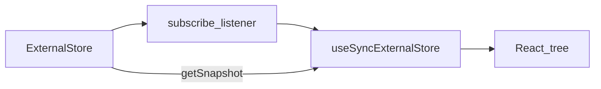

# tinystore

## What this project is

**tinystore** is a very small state helper for React. It is a learning exercise: I wanted a place to show **external stores**, **subscriptions**, **selectors**, and **`useSyncExternalStore`** without pulling a big framework.

This project is not trying to replace Zustand or Redux. It is more to show how a small external store can work with React subscriptions.

## Why I built this

I am a frontend engineer for a long time already, but I still like to go back to basics sometimes. With React 18, `useSyncExternalStore` is the correct tool for subscribing to a store that lives outside React. I wanted a tiny codebase where that pattern is obvious.

Also I wanted something for my portfolio that is honest about scope: small API, clear trade-offs, tests, and a demo that you can run locally.

## Problem

If you keep state only inside React, everything is simple. But when the state lives outside (cache, module singleton, tiny store), React needs a safe way to subscribe.

Before `useSyncExternalStore`, people used patterns that could **tear** in concurrent rendering (UI shows inconsistent values during the same frame). I did not want to teach an outdated pattern in 2026.

## How external stores work in React (very short)

Think about three pieces:

1. A store holds a snapshot of data.
2. When data changes, the store notifies subscribers.
3. React hooks into that notification and re-renders when the snapshot used by the component changed.



In this repo, `createStore` is the external store. `useStore` wraps `useSyncExternalStore` so React can subscribe safely.

## Why `useSyncExternalStore` matters

React can render in a way where work is interrupted. If you read an external value during render without a proper subscription contract, you can show a value that does not match what the user will see after commit.

`useSyncExternalStore` is the supported API to read external data during render and stay consistent. I am not an expert on the whole concurrent story, but for a store like this one, this hook is the right default.

## API examples

### create a store

```ts
// In this repo Vite maps `tinystore` -> `src/lib/index.ts`
import { createStore } from "tinystore";

const counterStore = createStore({ count: 0 });

counterStore.getState(); // { count: 0 }

counterStore.setState({ count: 1 });

counterStore.setState((state) => ({ count: state.count + 1 }));

const unsub = counterStore.subscribe((next, prev) => {
  console.log(next, prev);
});

unsub();
```

### useStore hook

```tsx
import { createStore, useStore, shallow } from "tinystore";

const store = createStore({ count: 0, name: "ada" });

function Count() {
  const count = useStore(store, (s) => s.count);
  return <button onClick={() => store.setState((s) => ({ count: s.count + 1 }))}>{count}</button>;
}

function Slice() {
  const part = useStore(
    store,
    (s) => ({ count: s.count, name: s.name }),
    shallow,
  );
  return (
    <pre>{JSON.stringify(part)}</pre>
  );
}
```

### optional debug helper

There is a tiny `debug(store, label?)` that logs `prev`, `next`, and `changed` keys. It is only for local debugging. In the demo app it is commented out in `App.tsx`.

## Technical decisions

- **Closure store, not a class.** Less noise for readers. No `this` surprises.
- **Immutable updates with shallow merge.** `setState` always does `{ ...state, ...patch }`. Deep updates are out of scope on purpose.
- **Selectors + optional `equalityFn`.** The default is `Object.is`. For object slices, `shallow` is exported as a practical default.
- **Snapshot caching inside `useStore`.** If the selector returns a new object every time, React would see a new snapshot every time. The small cache keeps the snapshot stable when the selected value is equal by your `equalityFn`.

## Trade-offs

- In dev, React `StrictMode` can render components twice on purpose. The yellow render badges can look a bit confusing because of that. In production build it is normal.
- No middleware, no devtools, no immer, no async layer.
- No built-in `persist`. You can add it yourself, but this repo does not try.
- `setState` always notifies listeners, even if the merge result is shallow-equal to the previous state. I prefer to keep the core dumb and predictable.
- This is **not** production-ready. I did not harden for every edge case. The goal is education + a clear story in code review.

## What I would improve next

- A second example with **derived state** (memoized selector outside React, or a tiny `derive` helper).
- Optional **middleware hook** (logger, redux-style actions) — still keeping the surface small.
- A note or mini benchmark about selector costs on large state (not because I love benchmarks, but because it is a real topic).

## Scripts

```bash
bun install
bun run dev
bun run test
bun run build
```

## Folder layout (for navigation)

- `src/lib` — the actual library code
- `src/demo` — UI only, not published as a package
- `src/tests` — vitest

## License

MIT — see [LICENSE](LICENSE).
